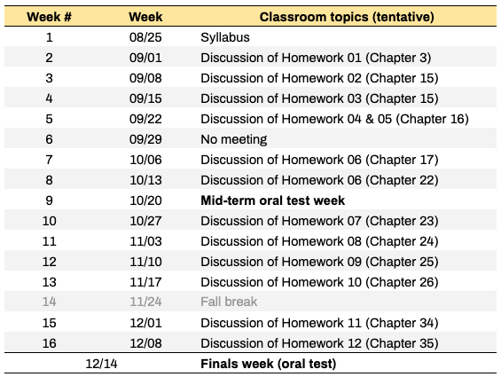

## Syllabus of Advanced Data Structures & Algorithms (CS 5130) - 2020 Fall

## A. Class and office hours
* Instructor: [Badri Adhikari](http://umsl.edu/~adhikarib/)
* Email: [adhikarib@umsl.edu](mailto:adhikarib@umsl.edu)
* Class meets: `TR 8:20PM - 9:35PM` (synchronously via Zoom)
* Office hours: Tuesdays 1:45PM to 3:45 PM

## B. About the course (Official course description)
* This course covers analysis of time and space complexity of iterative and recursive algorithms, design of data structures for efficient performance, mathematical modeling, dynamic programming, divide and conquer strategies, greedy algorithms, a collection of graph algorithms, linear and integer mathematical programming, and NP-Completeness. \[3 credit units\].

## C. Prerequisites  
* Graduate Standing in CS

## D. Textbook  
CLRS 3rd Edition (ISBN 978-0-262-03384-8 or ISBN 978-0-262-53305-8); at [amazon](https://www.amazon.com/Introduction-Algorithms-3rd-MIT-Press/dp/0262033844#ace-g7448806443).

## E. Course topics (Book's sections)

* **Chapter 3 - Growth of Functions**  
  - 3.1 Asymptotic notation  
  - 3.2 Standard notations and common functions  

* **Chapter 4 - Divide-and-Conquer**  
  - 4.1 The maximum-subarray problem  
  - 4.2 Strassen’s algorithm for matrix multiplication   
  - 4.3 The substitution method for solving recurrences  
  - 4.4 The recursion-tree method for solving recurrences   
  - 4.5 The master method for solving recurrences  

* **Chapter 15 - Dynamic Programming**  
  - 15.1 Rod cutting  
  - 15.2 Matrix-chain multiplication  
  - 15.3 Elements of dynamic programming  
  - 15.4 Longest common subsequence  

* **Chapter 16 - Greedy Algorithms**  
  - 16.1 An activity-selection problem  
  - 16.2 Elements of the greedy strategy  
  - 16.3 Huffman codes  

* **Chapter 17 - Amortized Analysis**  
  - 17.1 Aggregate analysis  

* **Chapter 22 - Elementary Graph Algorithms**  
  - 22.1 Representations of graphs  
  - 22.2 Breadth-first search  
  - 22.3 Depth-first search   

* **Chapter 23 - Minimum Spanning Trees**  
  - 23.1 Growing a minimum spanning tree  
  - 23.2 The algorithms of Kruskal and Prim  

* **Chapter 24 - Single-Source Shortest Paths**   
  - 24.1 The Bellman-Ford algorithm  
  - 24.2 Single-source shortest paths in directed acyclic graphs  
  - 24.3 Dijkstra’s algorithm  

* **Chapter 25 - All-Pairs Shortest Paths**  
  - 25.1 Shortest paths and matrix multiplication  
  - 25.2 The Floyd-Warshall algorithm  

* **Chapter 26 - Maximum Flow**  
  - 26.1 Flow networks  
  - 26.2 The Ford-Fulkerson method  
  - 26.3 Maximum bipartite matching  

* **Chapter 34 - NP-Completeness (skip proofs)**  
  - 34.1 Polynomial time  
  - 34.2 Polynomial-time verification  
  - 34.3 NP-completeness and reducibility  

* **Chapter 35 - Approximation Algorithms (skip proofs)**  
  - 35.1 The vertex-cover problem  
  - 35.2 The traveling-salesman problem  
  - 35.3 The set-covering problem  

## F. Course materials  
* All course materials are inside the relevant folders in Github location
* Recorded lectures of the chapters are [here](./LECTURES.md)
 
## H. Course schedule

## I. General policies
* Keep yourself out of plagarism; Read [UMSL's Policy](https://www.umsl.edu/services/academic/policy/academic-dishonesty.html); Our `turnitin` tool automatically checks for plagarism; Here is an [example](supporting_files/turn-it-in.png).
* Lecture recordings, audio or video, are not permitted.

## J. Programming language
* Python3 is language for the course; you are expected to use Python3 for all of your classroom activities, homeworks, and project.
* You are also required to use [Google colab](https://colab.research.google.com) or your own hosted Jupyter Notebook for running your programs.

## K. Due dates and late policy  
* Homeworks and project phases have their respective due dates (see Schedule).
* All activities will be graded before the last week of the semester (i.e. 12/01). You can resubmit activities as many times as you want. Your most recent submission will be graded.
* You can request a maximum two-day extension on any homeworks or project submissions - for up to two submissions. 
* If you email me a few hours before a deadline and I don't reply you immediately, and if you have not used your two-day extensions, you can assume that the extension is granted automatically.
* Once you use your extension days, late submissions will get no points.

## L. Course project
* See [here](PROJECT.md).

## M. Classroom activities
* See [here](activities/README.md).

## N. Homeworks
There will be two types of homeworks:  
1. Writing chapter summaries, and 
2. Project phases (see [project](./PROJECT.md))

### Chapter summary homeworks
The homework here is to write a 1000 words summary of each chapter after watching the [recorded lectures](./LECTURES.md). Please see the course schedule above for submission deadlines.
1. Your summary should be at least 1000 words (at least 1500 words for graduate students) of `plain text`.
1. All text must be `in your own words` and anything copied must be quoted and cited appropriately.
1. Your summary should not be all bullets, use bullets only when appropriate.
1. Your chapter summary must be divided into the [topics of the chapter](./LECTURES.md). For example, the summary on the chapter `Preception` should have the corresponding four sections.
1. All homeworks will be automatically checked for plagarism using the Canvas plugin Turnitin. If you copy/paste contents from the Internet, you will receive a `zero` for your submission. Serious actions will be taken for any repeated plagarism.

## O. Oral tests
The mid-term and finals for this course will be in the form of oral tests, via Zoom one-on-one meetings. Each meeting may be up to 30 minutes long. Although some oral questions may check your understanding of the concepts, questions on the oral test will mostly focus on the details. Questions in the oral test will be from your own submissions - homeworks, activities, and project submissions. I will randomly pick one of your submissions, and ask you some details. Some students who have done exceptionally well may be exempt from the oral test. I will send an email to you if you are exempt, you cannot email and ask to be exempt. Closer to the mid-term and finals week, you will be able to sign-up to select a time that works for you. Here are two example questions:
1. In your homework number 3, in paragraph 5, you discuss X and Y. Please mention the purpose of X.
1. In your activity 10 submission's Notebook, please explain why you wrote the codes in line number 6.

## P. Attendance
* Attendance will be recorded sometimes.
* Uninformed missing of three consecutive classes in a row may lead to failing the course.

## Q. Grade composition  
* 10 chapter summaries * 2 = 20 points
* 3 project phases * 6 = 18 points
* 1 final project report * 12 = 12 points
* 20 activities * 1 = 20 points
* 2 oral tests * 15 = 30 points 
* 1 bonus point to everyone who complete the course evaluation survey (please email me once you submit the survey)

## R. Grading scheme  
   

## S. Resources
* [Resources & Support](https://umsl.instructure.com/courses/44471/pages/student-resources-and-supports?module_item_id=454221)
* [Technology Assistance](https://umsl.instructure.com/courses/44471/pages/technology-assistance?module_item_id=454223)

