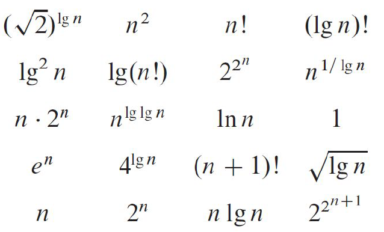

# Google Colab and Python
* Watch how to use [Google Colab](https://www.youtube.com/watch?v=PVsS9WtwVB8)
* Practice Python3 - [notebook](../notebooks/python.ipynb) and watch [lecture](https://www.youtube.com/watch?v=V42qfAPybp8)
* If you are new to Python, I suggest practicing Python at online platforms such as [codewars.org](https://www.codewars.com/)

# Read sections 3.1 and 3.2 from CLRS
Please read this with the goal of using the knowledge to do the homework below.

# Watch the recorded lectures
- [Introduction](https://youtu.be/rP-sx1y4RS0)
- [Review insertion sort](https://www.youtube.com/watch?v=JU767SDMDvA)
- [Review merge sort](https://www.youtube.com/watch?v=4VqmGXwpLqc)
- [Asymptotic notations - will post soon]()

# Question 1
Reorder the following terms from lowest to highest time complexity, using `<` between terms. If two terms have the same complexity, use an equal sign instead. Assume `n>1` and `k` is a constant.
- O(n2)    
- O(kn)  
- O(1)  
- O(100000 * n)  
- O(n!)  
- O(lg n)  - lg is log2  
- O(2n)  
- O(n)  
- O(k lg n)  
- O(n100000)  
- O(n * lg n)  

# Question 2 (CLRS 3.1-3)
- Explain why the statement, "The running time of algorithm A is at least O(n2)," is meaningless.

# Question 3 (CLRS 3.1-4)
- Is 2n+1 = O(2n)? Explain.  
- Is 22n = O(2n)? Explain.    

# Question 4 (From CLRS 3-3(a))
Rank the following functions by order of growth and **describe how you obtained the ranking**; i.e. find an arrangement g1, g2, ..., gN of the functions satisfying g1 = Ω(g2), g2 = Ω(g3), ..., gn-1 = Ω(gN). Also discuss which of the functions are equivalent (by reducing whichever ones can be reduced).  Hint: Besides the mathematical analysis, two additional techniques that you MAY use to determine the growth are: (a) plotting the functions, and (b) timing the execution of the functions as shown [here](timing-execution.md).

**Help:**   
- https://atekihcan.github.io/CLRS/P03-03/  
- https://atekihcan.github.io/CLRS/E03.01-04/  
